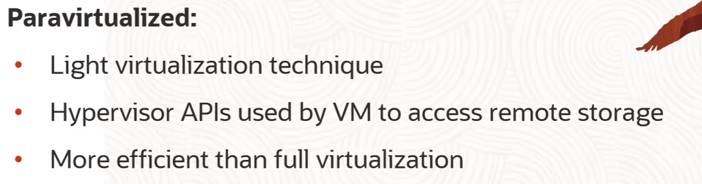
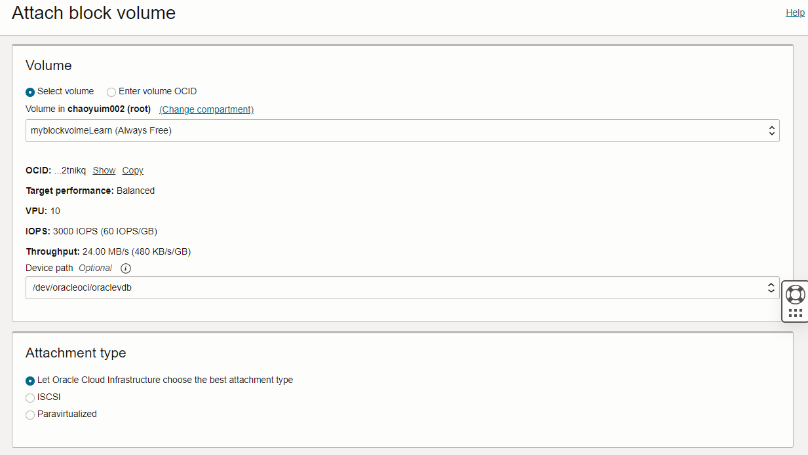
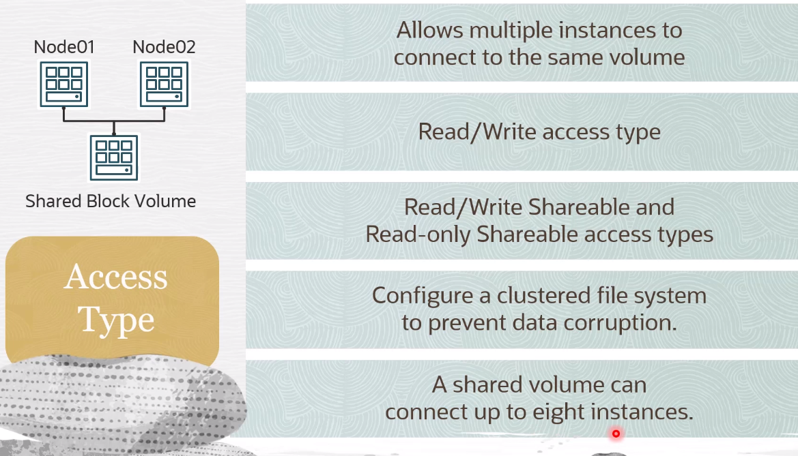
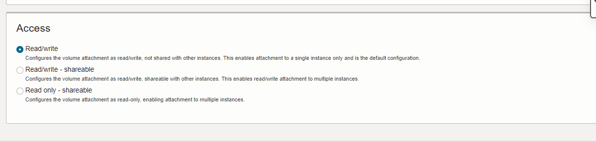
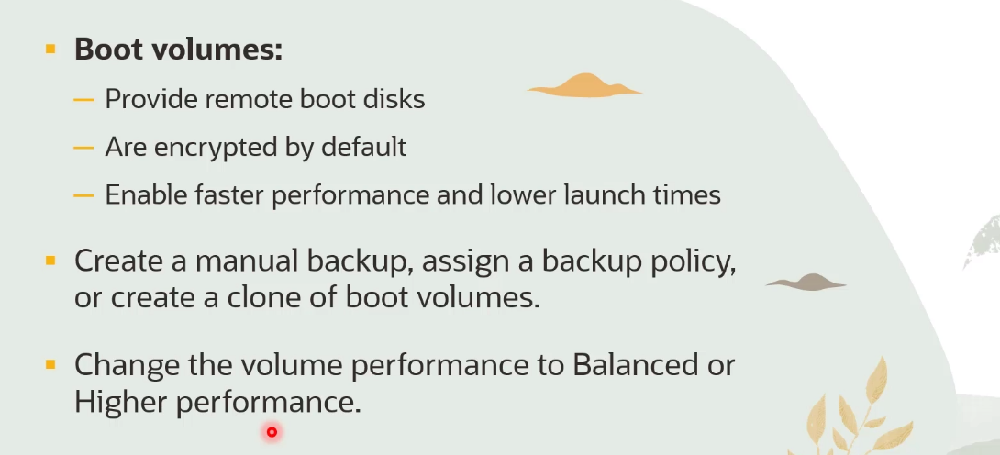

# Block Storage Basic & Adanced

- [Block Storage Basic \& Adanced](#block-storage-basic--adanced)
  - [Overview](#overview)
    - [Local NVMe](#local-nvme)
    - [Block Volume](#block-volume)
  - [Volume Attachment Types](#volume-attachment-types)
  - [Volume Access Type](#volume-access-type)
  - [Boot Volume](#boot-volume)

## Overview 

### Local NVMe 
 
 - :black_large_square: Local NVMe SSD devices are available to some compute instance shapes (such as BM.DenselO2.42) include locally attached NVMe Devices
 - :black_large_square: it has extremely low latency (since it is attached to the motherboard)
 - :black_large_square: High performance
 - :black_large_square: idea for big data, OLTP
 - :black_large_square: It is up to customer to protect and manage the durability of data

### Block Volume

## Volume Attachment Types
When you attach a block volume to an instance, you have the following ways
>iSCSI

>Paravirtualized

## Volume Access Type

## Boot Volume
