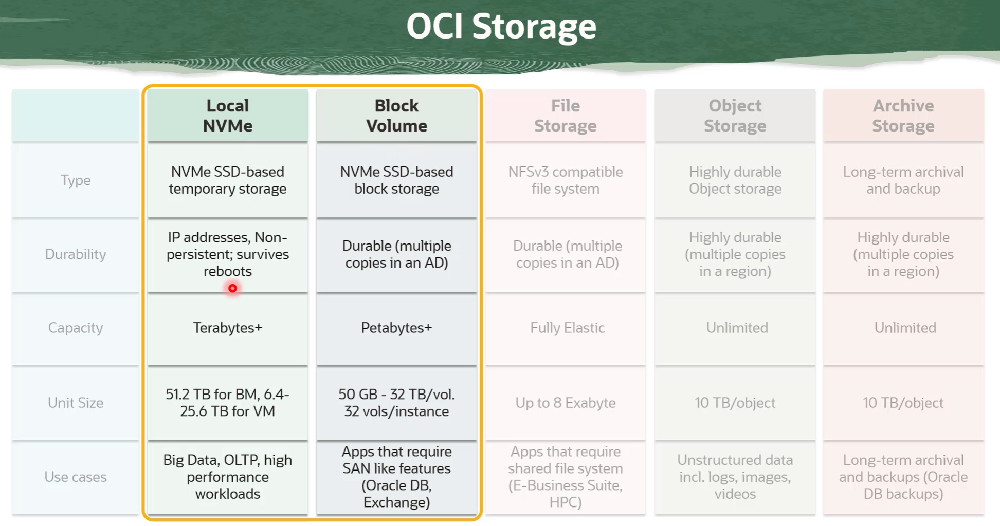

# Block Storage Basic & Adanced

- [Block Storage Basic \& Adanced](#block-storage-basic--adanced)
  - [Overview](#overview)
    - [Local NVMe](#local-nvme)
    - [Block Volume](#block-volume)
  - [Volume Attachment Types](#volume-attachment-types)
  - [Volume Access Type](#volume-access-type)
  - [Boot Volume](#boot-volume)
    - [Boot Volume performance](#boot-volume-performance)
    - [Boot Volume Dynamic Performance Scalling](#boot-volume-dynamic-performance-scalling)
  - [Resize a Volume](#resize-a-volume)
    - [Steps to do online Resizing](#steps-to-do-online-resizing)
  - [Volume Backup and Restoration](#volume-backup-and-restoration)
  - [Volume Clones](#volume-clones)
  - [Volume Clones VS Volume Clone](#volume-clones-vs-volume-clone)
  - [Cross Region Replications](#cross-region-replications)
  - [Volume Groups](#volume-groups)
  - [Cross Availability Domain Replication](#cross-availability-domain-replication)
  - [Block Volume Encryptions](#block-volume-encryptions)
  - [Skill Checks](#skill-checks)

## Overview 

### Local NVMe 
 
 - :black_large_square: Local NVMe SSD devices are available to some compute instance shapes (such as BM.DenselO2.42) include locally attached NVMe Devices
 - :black_large_square: it has extremely low latency (since it is attached to the motherboard)
 - :black_large_square: High performance
 - :black_large_square: idea for big data, OLTP
 - :black_large_square: It is up to customer to protect and manage the durability of data

### Block Volume

## Volume Attachment Types
When you attach a block volume to an instance, you have the following ways
>iSCSI

>Paravirtualized

## Volume Access Type

## Boot Volume

### Boot Volume performance 

--------------------------

> There are 4 performance levels
>
- [ ] Lower Costs - :warning: `Only available for block volumes, not for  BOOT volume`
- [x] Balanced - `Default`
- [ ] Higher Performance 
- [ ] Ultra High Performance :warning: `Only available for block volumes`

### Boot Volume Dynamic Performance Scalling

> there are 2 type of dynamic performance scalling with autotuning

- [x] Performance Based Autotuning `Use needs to define the default(min) and Max performance VPUs`
- [x] Detached  Volume Autotuning  :zzz: `Once volume detached, volume performance level is set to Lower Cost`

:sparkles: These two settings can be enabled at the same time. 

## Resize a Volume 
> :warning: One can `only increasing` a Volume Size, `NOT` decrease

> :star: One can choose `online  resizing ` or  `Offline Resizing`
> 

### Steps to do online Resizing

1. Edit Volume to a larger size 
2. SSH to instance 
3. Run shell script to rescan - `shell cmd is showing on OCI console during resizing settings`
4. Run shell script to Extend partition  - `find in online doc`

## Volume Backup and Restoration

> Two Wyas to initiate a backup
>

> Two Types of backups
>
:white_large_square: Incremental

:white_large_square: Full backup 

------------------

 :cloud: Oracle backup Policies 

- :earth_africa: Bronze 
  - Incremental Backups
    - Monthly incremental backup ( Retention Period of 12 month)
  - Full Backups
    - Yearly full Backup ( Retention Period of 5 years)
  
- :earth_africa: Silver (+ Bronze)
  - everything from Bronze
  - Weekly incremental backups (Retention Period of 4 weeks)

- :earth_africa: Gold (+ Silver + Bronze)
  - everything from Bronze
  - everything from Silver
  - daily incremental backups (Retention Period of 7 days)
---------------

 :cloud: Customized, User-defined backup policy

:grey_exclamation: `User can define the schedules, types of backup (incremental, full) and retention period.` 

## Volume Clones

Cloning enables you to make a copy of an existing block volume without needing to go through the backup and restore process. A cloned volume is a point in time direct disk-to-disk deep copy of the source volume. So all the data that is in the source volume when the clone is created is copied to the cloned volume. And any subsequent changes to the data on the source volume are not copied to the clone.

## Volume Clones VS Volume Clone

## Cross Region Replications
> :warning: Depending on the source regions, the destination regions can be limited
>

## Volume Groups
> :warning: you can only group Block/Boot Volume in the `Same Available Domain`.

User case of Volume Grouping

Volume groups can simplify the process to create time consistent backups of running enterprise applications. There is also a capability to perform volume group backups automatically on a schedule and retain them based on a particular backup policy. The benefit is you can then restore an entire group of volumes from a volume group backup. The best part is volume group is available at no additional charge.

> Actions you can perform on a volumes groups
>
   :white_check_mark: Create Group Back

   :white_check_mark: Group Clone

   :white_check_mark: Move Resources

   :white_check_mark: During Creation enable Cross Region Replication

## Cross Availability Domain Replication
:heavy_exclamation_mark: The only difference between Cross AD and Cross Region related to costs is that Cross AD does not include network traffic costs

## Block Volume Encryptions

Block Volume can be encrypted by both 
- [ ] oracle managed keys (default)
- [ ] or customer created keys

:heavy_exclamation_mark: To allow block volume or any other service to use customer management keys, a new policy need to be create 

    Allow service blockstorage to use keys in tenancy

## Skill Checks

1. Which of the following is NOT a block volume performance level?

    :white_large_square: Higher Performance

   :white_check_mark: Optimized (*)

    :white_large_square: Lower Cost

    :white_large_square: Ultra High Performance

2. What happens when the detached volume autotuning feature is enabled and the volume is detached from the instance?
   
    :white_check_mark: The Block Volume service adjusts the performance level to Lower Cost. (*)

    :white_large_square: The Block Volume service adjusts the performance level to Ultra High Performance.

    :white_large_square: The Block Volume service adjusts the performance level to Higher Performance.

    :white_large_square: The Block Volume service adjusts the performance level to Balanced.

3. Which two are options for attachment type when you attach a block volume to a VM instance?

    :white_large_square: SMB

    :white_check_mark: iSCSI (*)

    :white_check_mark: Paravirtualized (*)

    :white_large_square: NFS    

4. You want to attach a block volume to a VM instance and one of your requirements is to get a better IOPS performance. Which volume attachment type would you use?
   
    :white_large_square: NFS

    :white_large_square: Paravirtualized

    :white_large_square: SMB

    :white_check_mark: iSCSI (*)    

5. Which three of the following are options for access type when you attach a block volume to an instance?

    :white_large_square: Read/Execute

    :white_check_mark: Read-only-Shareable (*)

    :white_check_mark: Read/Write-Shareable (*)

    :white_check_mark: Read/Write (*)

    :white_large_square: Write/Execute    

6. Which two statements about resizing a block volume are correct?
   
    :white_check_mark: You can restore from a volume backup to a larger volume. (*)

    :white_check_mark: You can expand an existing volume in place with online resizing. (*)
    
    :white_large_square: You can increase as well as decrease the size of the volume.

    :white_large_square: You can clone an existing volume to a new, smaller volume.

7. You would like to make a point-in-time `snapshot` of the data on a block volume and later restore it as a new volume in a different availability domain within the same region. What would you create?
   
    :white_large_square: A clone

    :white_check_mark: A backup (*)

    :white_large_square: A replica

    :white_large_square: A prototype

8. Which statement about the OCI Block Volume Cross Region Replication is NOT correct?
    
    :white_large_square: It does not cause any downtime or impact on source volumes.

    :white_large_square: The replica in the destination region is always billed using the Block Storage Lower Cost option price.
    
    :white_large_square: It performs ongoing automatic asynchronous replication of block volumes to other regions.
    
    :white_check_mark: You can resize a volume with Cross Region Replication enabled. (*)

9. Which two of the following statements about volume groups are correct?
   
    :white_large_square: When you delete a volume group, the individual volumes in the group are deleted.

    :white_check_mark: You can add up to 32 volumes in a volume group. (*)

    :white_large_square: Each volume can be a part of multiple volume groups.

    :white_check_mark: A volume group can include both boot volumes and block volumes. (*)

10. You would like to make a point-in-time disk-to-disk deep copy of an existing block volume without needing to go through the backup and restore process. What would you create?
   
    :white_large_square: A twin

    :white_large_square: A replica

    :white_large_square: A prototype

    :white_check_mark: A clone (*)