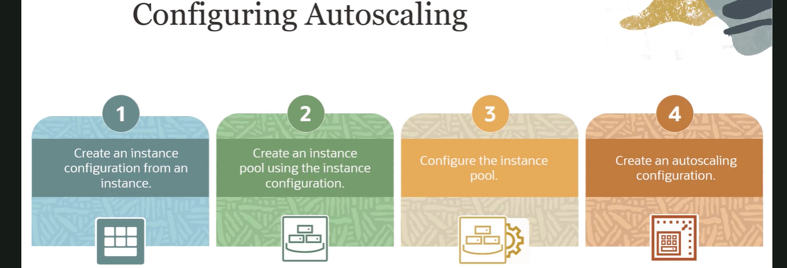
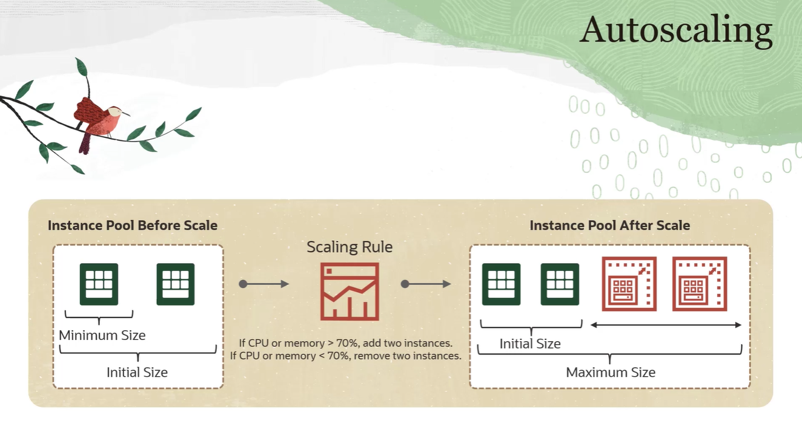
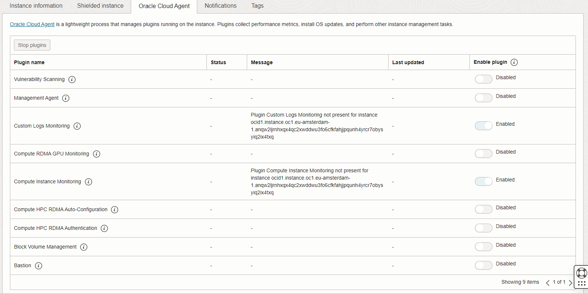

# Compute Adanced

- [Compute Adanced](#compute-adanced)
  - [Burstable Instance](#burstable-instance)
  - [Vertical Scalling](#vertical-scalling)
  - [Compute Auto Scalling](#compute-auto-scalling)
  - [Oracle Cloud Agent](#oracle-cloud-agent)

## Burstable Instance

> :grey_question: What is Burstable Instance

  A burstable instance is a `virtual machine instance` that provides a `baseline level of CPU performance` with the ability to `burst to a higher level to support occasional spikes in usage`. Burstable instances are designed for scenarios where an instance is typically idle or has low CPU utilization with occasional spikes in usage.

> :grey_question: Why Burstable Instance

  It is cheaper than regular Instance, Burstable Instance provides a ``base line of 12.5% or 50% CPU performance``, Burst is contingent on available capactity, if a physical host is over subscriped, no boost will take place. . However the ``cost is charged based on baseline`` settings. 

> :eyes: No all instances support Burst

## Vertical Scalling 

> :sunny: :grey_question: What is Vertical Scaling?

Vertical Scalling is about taking an existing instance and upgrade its CPU count and RAM amount.

> :sunny: when scalling up / down the instance needs a reboot

IP wont change

> Automating Vertical Scalling?

With monitor service plus a function, there is a way to trigger an automatic scalling. But this will put instance into reboot which will create some ``downtime`` for your application. 

## Compute Auto Scalling 

 - [x] Instance Copnfiguration
   - Instance configuration is a ``template`` that defines the settings to use when creating ``single instances`` or ``Instance Pools``
   - It **does not** include any block volume
 - [x] Instance Pool
   - is a set of instances managed as a group
   - one instance pool can only associate with only 1 instance configuration
 - [x] Autoscalling Policy
   - [x] **Schedule** based autoscalling 
   - [x] **Performance/Metric** based autoscalling

## Oracle Cloud Agent

> What is Oralce Cloud Agent

is a lightweight process that manages plugins running on the instance. Plugins collect performance metrics, install OS updates, and perform other instance management tasks. e.g **bastion**

- [OS Management](#)
- [Run Command](#)
- [Instance Console Connection](#)
- [Shelded Instances](#)
- [Confidential Computing](#)
- [Skill Check](#)
