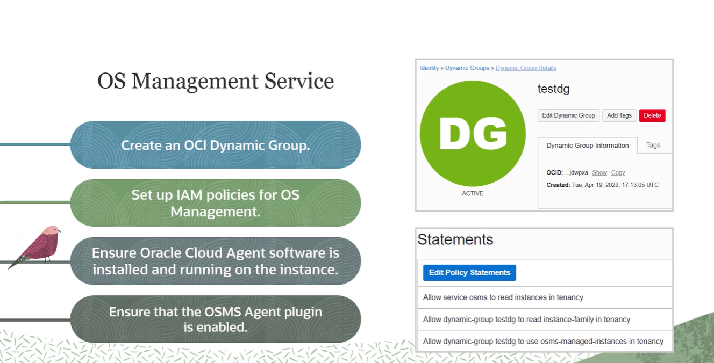
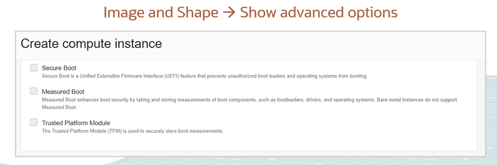

# Compute Adanced

- [Compute Adanced](#compute-adanced)
  - [Burstable Instance](#burstable-instance)
  - [Vertical Scalling](#vertical-scalling)
  - [Compute Auto Scalling](#compute-auto-scalling)
  - [Oracle Cloud Agent](#oracle-cloud-agent)
    - [Bastion \& OSMS Agent](#bastion--osms-agent)
    - [OS management service](#os-management-service)
    - [Run Command](#run-command)
    - [Instance Console Connection](#instance-console-connection)
  - [Infrastructure Maintenance](#infrastructure-maintenance)
    - [:link: Relocating a VM Instance](#link-relocating-a-vm-instance)
  - [Shielded Instances](#shielded-instances)
    - [:question: What is _Secure Boot_ ?](#question-what-is-secure-boot-)
    - [:question: what is _Measure Boot_ ?](#question-what-is-measure-boot-)
    - [:question: what is _TPM_ ?](#question-what-is-tpm-)
  - [Confidential Computing](#confidential-computing)
- [Skill Check](#skill-check)

## Burstable Instance

> :grey_question: What is Burstable Instance

  A burstable instance is a `virtual machine instance` that provides a `baseline level of CPU performance` with the ability to `burst to a higher level to support occasional spikes in usage`. Burstable instances are designed for scenarios where an instance is typically idle or has low CPU utilization with occasional spikes in usage.

> :grey_question: Why Burstable Instance

  It is cheaper than regular Instance, Burstable Instance provides a ``base line of 12.5% or 50% CPU performance``, Burst is contingent on available capactity, if a physical host is over subscriped, no boost will take place. . However the ``cost is charged based on baseline`` settings. 

> :eyes: No all instances support Burst

## Vertical Scalling 

> :sunny: :grey_question: What is Vertical Scaling?

Vertical Scalling is about taking an existing instance and upgrade its CPU count and RAM amount.

> :sunny: when scalling up / down the instance needs a reboot

IP wont change

> Automating Vertical Scalling?

With monitor service plus a function, there is a way to trigger an automatic scalling. But this will put instance into reboot which will create some ``downtime`` for your application. 

## Compute Auto Scalling 

 - [x] Instance Copnfiguration
   - Instance configuration is a ``template`` that defines the settings to use when creating ``single instances`` or ``Instance Pools``
   - It **does not** include any block volume
 - [x] Instance Pool
   - is a set of instances managed as a group
   - one instance pool can only associate with only 1 instance configuration
 - [x] Autoscalling Policy
   - [x] **Schedule** based autoscalling 
   - [x] **Performance/Metric** based autoscalling

----------------

## Oracle Cloud Agent

> What is Oralce Cloud Agent

is a lightweight process that manages plugins running on the instance. Plugins collect performance metrics, install OS updates, and perform other instance management tasks. e.g **bastion**

> what does Oracle Cloud Agent Do?
> - [x] Collect Instance Performance Metrics
> - [x] Install Operating system updates
> - [x] .. and other instance management tasks

### Bastion & OSMS Agent
- ``Bastion`` for SSH 
- ``OSMS Agent`` for manages patches and updates for OS environment
----------

### OS management service

> What is OS management Services

OS Management is an Oracle Cloud Infrastructure Service that provides automated operating system patch and package management for ``ONLY`` **Oracle Linux** and **Windows**.

> :sunny: To use it, the following settings are required 
> -----
> :heavy_exclamation_mark: this feature takes a long time to activate

---
- [x] OCI dynmaic group
- [x] IAM policies for OS management
- [x] Enable Cloud Agent software on Instance
- [x] Enable OSMS plugin   
----

### Run Command

  So what is a run command? Well, using run command, you can remotely configure, manage, and troubleshoot compute instances by running scripts within the instance. You can run commands on an instance even when the instance does not have SSH access or open inbound ports.

  The run command feature is supported on compute instances that use the platform images. So Oracle Autonomous Linux, Oracle Linux, CentOS, and Windows Server are supported. But Ubuntu is not supported.

  On Linux instances, the script runs in a bash shell by default. And on Windows instances, the script runs as a batch file. The maximum size for a script file that you can upload directly to an instance in plain text is 4 KB.

  To provide a larger file, save the file in an object storage location. The output of a script when written as plain text is limited to last 1 KB. To save a larger response, you can save the output to an object storage location.

### Instance Console Connection 

  The idea of a console connection is to give you a display of what is happening during the boot process. So you can remotely troubleshoot malfunctioning instances using console connections. And this is a special case, which you do not use for normal operations but for troubleshooting.

## Infrastructure Maintenance

### :link: Relocating a VM Instance
Three options are provided when it comes to relocating a vm instance, they are.
- [X] live migration
  - lease disruption
  - only on available on linux and specific shapes
- [x] reboot migration (due date migration)
  - short downtime 
- [x] Manual migration
  - preserve boot volume 
  - create new instance with boot volume
  - most work

## Shielded Instances
> what is ?

it helps to harden the firmware security, defend against malicious boot level software. When you select supported platform and shape, you will see these options
- [ ] Secure Boot
- [ ] Measure Boot (:warning: only for VM instances,not on baremetal)
- [ ] TPM trusted platform Module

### :question: What is _Secure Boot_ ?
`Secure Boot is a Unified Extensible Firmware Interface feature that prevents unauthorized bootloaders and operating systems from booting. So boot components that are not properly signed are not allowed to run, preventing the system from booting.`
###  :question: what is _Measure Boot_ ?
`Measured Boot complements and enhances Secure Boot by storing measurements of boot components, such as bootloaders, drivers, and operating systems. And it verifies that these measurements don't change from one boot to the next.`

### :question: what is _TPM_ ?
`Trusted Platform Module is a specialized security chip that is used by the Measured Boot to store the boot measurements securely. Enabling Measured Boot for virtual machines automatically enables the virtual Trusted Platform Module`

--------------
## Confidential Computing
>  :question: What is Confidential Computing?

Confidential computing protects data in use at the hardware level. In confidential computing, both the data and the application processing the data are encrypted and isolated while the application processes the data. And that basically prevents unauthorized access or modification of either the data or the application.

# Skill Check
