# File Storage

- [File Storage](#file-storage)
  - [Overview](#overview)
    - [File Storage Concepts](#file-storage-concepts)
      - [what is Mount Target](#what-is-mount-target)
      - [what is Export](#what-is-export)
      - [Infra Chart](#infra-chart)
  - [Steps to Mount  File System](#steps-to-mount--file-system)
    - [NFS Export Options](#nfs-export-options)
      - [Example](#example)
      - [:warning:](#warning)
      - [Access Control Settings](#access-control-settings)
      - [File System Path](#file-system-path)
        - [what is Export path](#what-is-export-path)
        - [What is Mount point path](#what-is-mount-point-path)
        - [What is File System path](#what-is-file-system-path)
  - [File storage snapshot](#file-storage-snapshot)
  - [File Storage Cloning](#file-storage-cloning)
  - [In-transit Encryptions for File Storage system](#in-transit-encryptions-for-file-storage-system)
  - [File system Replication](#file-system-replication)
  - [Skill Checks](#skill-checks)

## Overview 

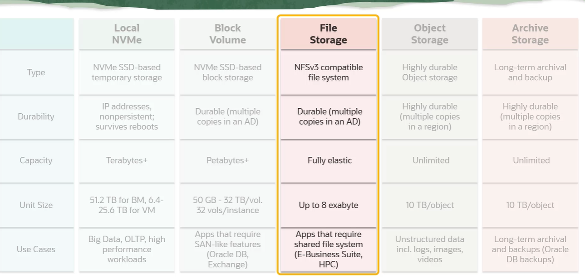

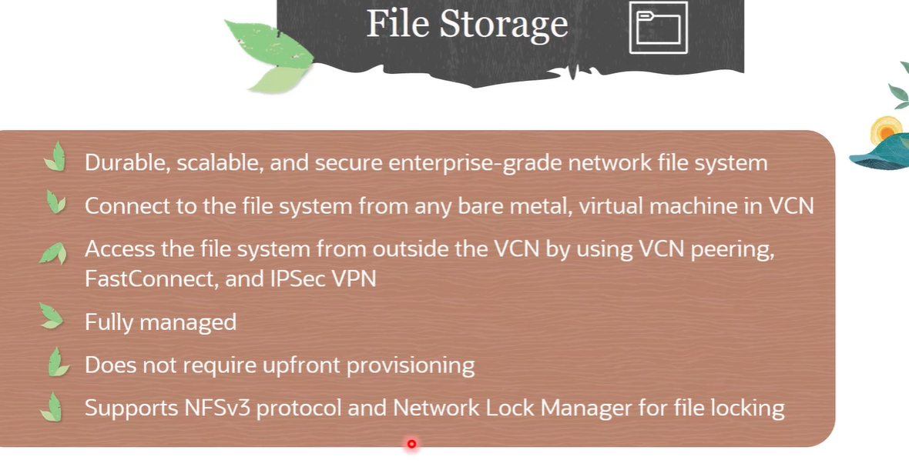

### File Storage Concepts

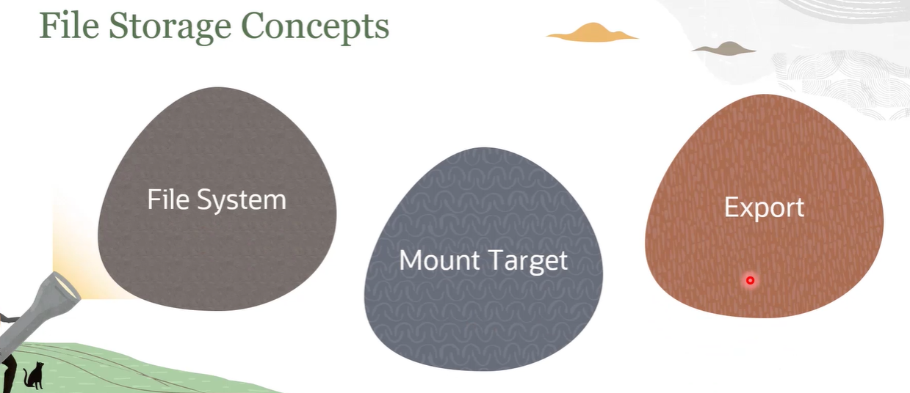

#### what is Mount Target
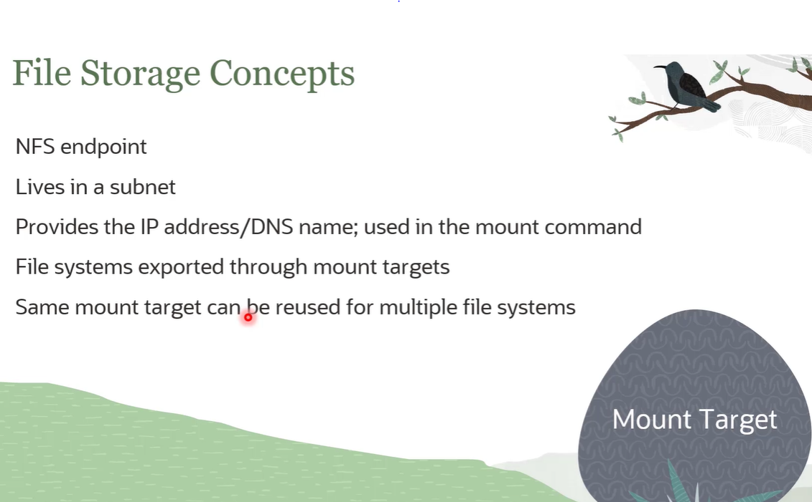

#### what is Export
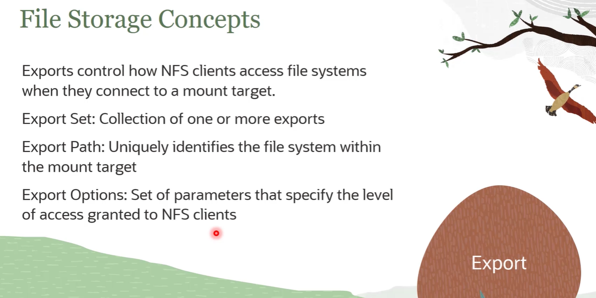

#### Infra Chart
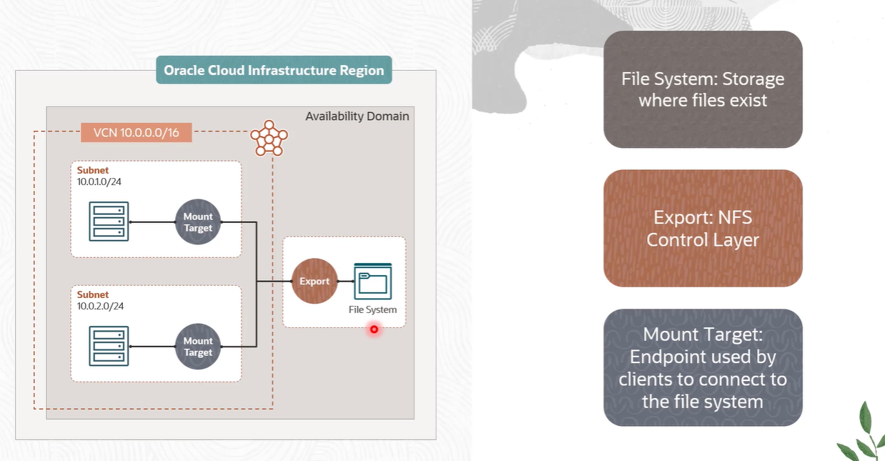

## Steps to Mount  File System

> :one: Check Security List and Network Security Group for access rules

> :two: Launch OCI Instance

> :three: Install nfs-units or nfs-common

> :four: create a directory

> :five: check mount targets in the OCI console

> :six: copy the mount commands and run on the client

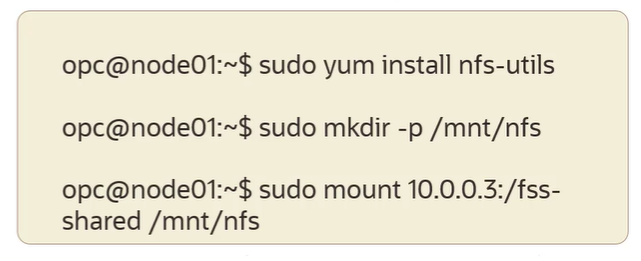  


### NFS Export Options

NFS Export Options enable you to create more granular access control. You can specify access levels for IP addresses or CIDR blocks, connecting to the file system through exports in a mount target. And access can be restricted so that each client's file system is inaccessible and invisible to the other so you can control access to the file system. NFS Export Options are a set of parameters within the Export that specifies the level of access granted to NFS clients when they connect to a mount target.

  

#### Example
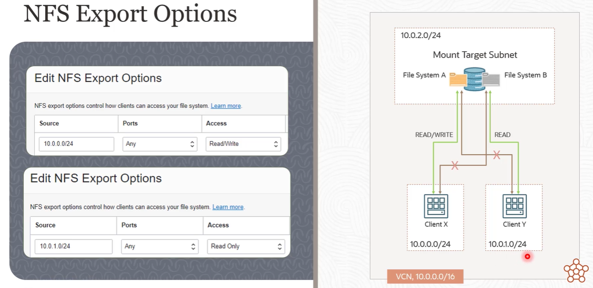  

:a: 

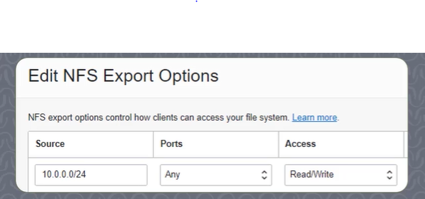 

:b:

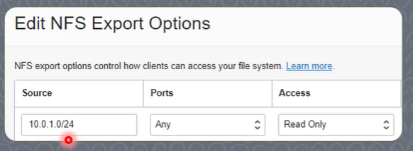 

#### :warning:
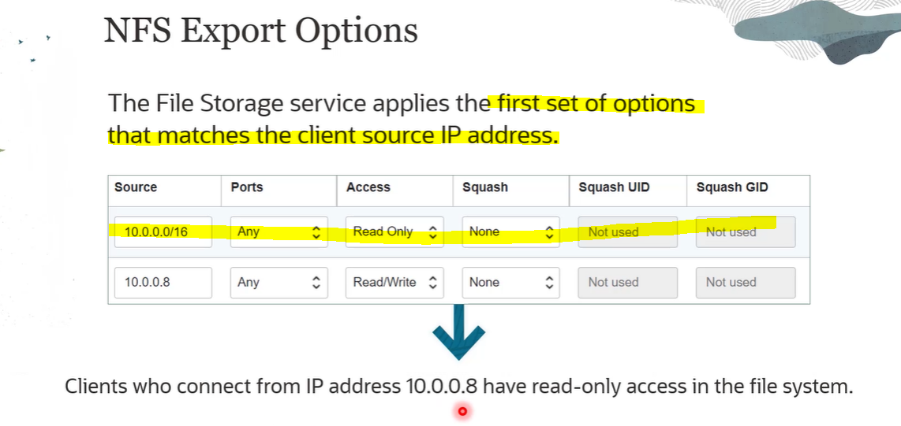

#### Access Control Settings
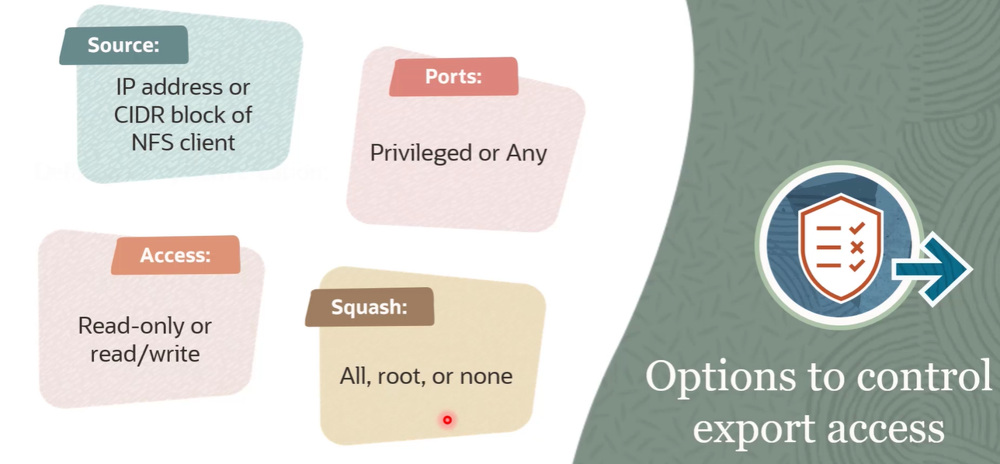

#### File System Path
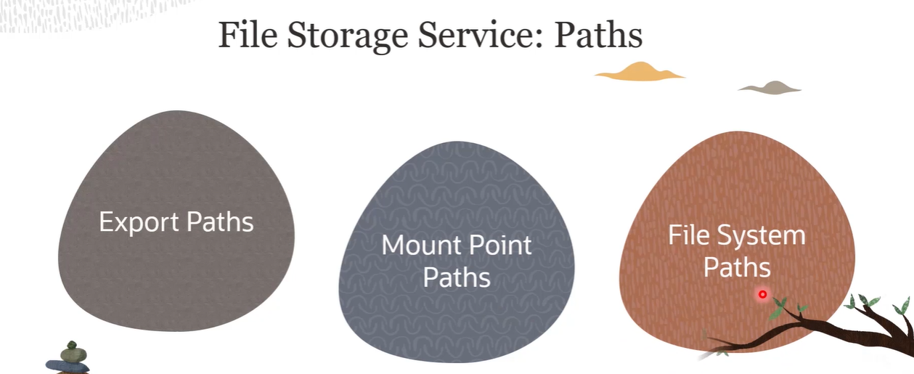

##### what is Export path
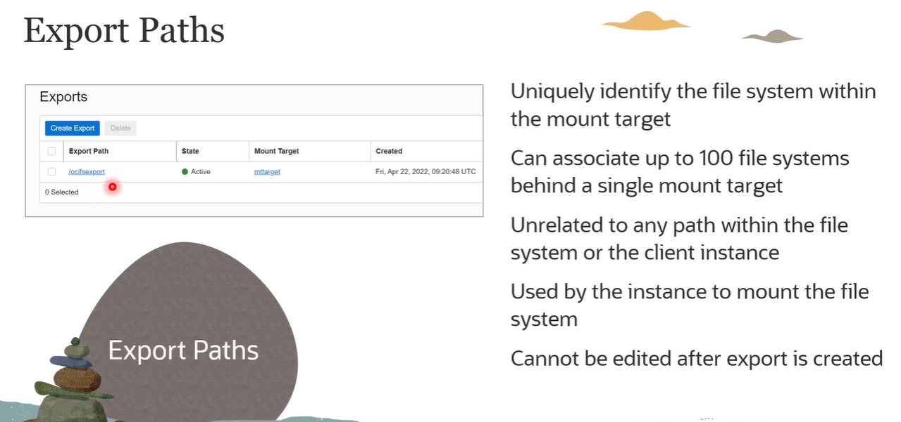

##### What is Mount point path
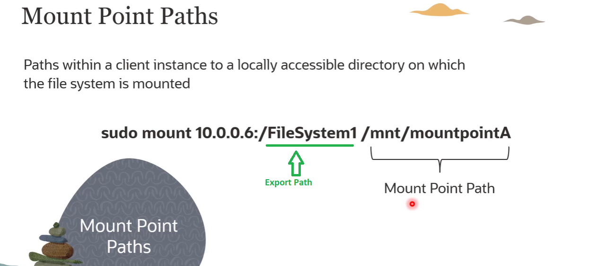


##### What is File System path
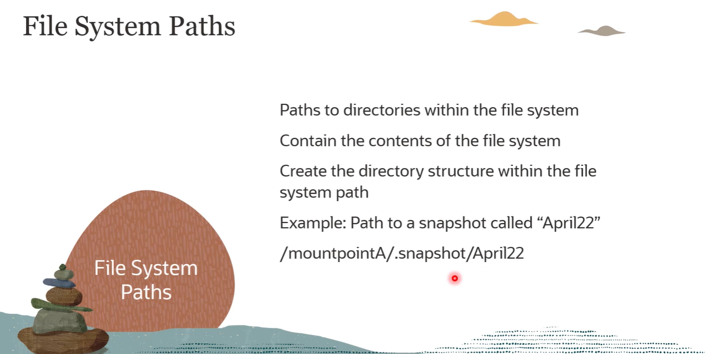


## File storage snapshot
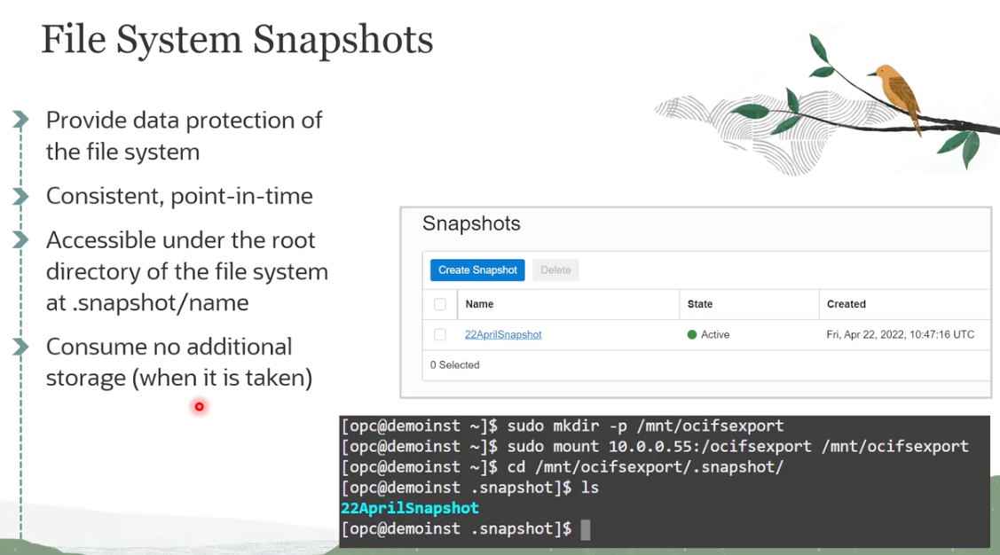

> there are two ways to create a snapshot

- [x] via OCI console
- [x] via SSH console
  ```shell
    cd /pathtoyoursnapshot/.snapshot
    sudo mkdir snapshot-xx 
  ```  

> How to restore files from snapshot
⚠️: basically copy files from snapshot into your working directory
```shell 
sudo cp -r * /
```

## File Storage Cloning

> What is file system clone?

A clone is a NEW file system/storage that is created based on a snapshot of an existing file system.

A clone is a `new file system`  that is created `based on a snapshot  of an existing file system`. Snapshots preserve the state of the data of a file system at a particular point in time. If you take snapshots of a file system at regular intervals, you can create clones of the file system as it existed at multiple points in its lifetime.

A snapshot provides the initial blueprint for a clone. You can clone a parent file system, or you can clone a clone, as long as there's at least one snapshot available. At the point of creation, the data included in the clone is identical to the data in the snapshot. After creation, data changes in the clone aren't included in the original file system. Conversely, any data changes to the original file system aren’t included in the clone. All file systems operate independently of each other, regardless of whether they are parent file systems, clones, or clones of clones.


## In-transit Encryptions for File Storage system

> what is in-transit encriptions?
> 

## File system Replication


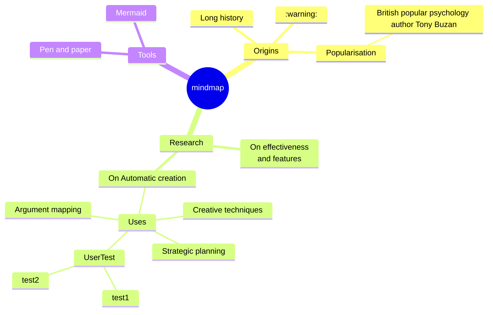


## Skill Checks

1. Which component represents paths within a client instance to a locally accessible directory to which the remote file system is mounted?
 
    :white_large_square: Import Path

    :white_large_square: Dump Path
    
    :white_large_square: Export Path
    
    :white_check_mark: Mount Point Path (*)

1. Which of the following statements about the OCI File System Mount Target is NOT true?

    :white_large_square: File systems are exported through mount targets.
    
    :white_check_mark: You cannot reuse the same mount target to make multiple file systems available on the network. (*)

    :white_large_square: It provides the IP address or DNS name that is used with a unique export path to mount the file system.

    :white_large_square: It is an NFS endpoint that is present in a VCN subnet.

    > :star: A mount target is an NFS endpoint that lives in a VCN subnet of your choice and provides network access for file systems. You can reuse the same mount target to make as many file systems available on the network as you wish. To reuse the same mount target for multiple file systems, create an export in the mount target for each file system.


3. Which statement about the OCI File System Export is correct?

    :white_large_square: You cannot delete exports in a mount target.

    :white_large_square: The export path is the same as the client mount point path.

    :white_check_mark: You can add export options to an export to control access to the file system. (*)

    :white_large_square: Each export set contains only one export.


4. Which component uniquely identifies the file system within the mount target, letting you associate many file systems to a single mount target?

    :white_check_mark: Export Path (*)

    :white_large_square: Import Path

    :white_large_square: Mount Point Paths

    :white_large_square: Dump Path

5. Which statement about Oracle Cloud Infrastructure (OCI) File Storage service is correct?

    :white_check_mark: The File Storage service supports the Network File System version 3.0 (NFSv3) protocol. (*)
    
    :white_large_square: Storage provisioning is not fully managed.
    
    :white_large_square: You cannot access a file system from outside the VCN.
    
    :white_large_square: You cannot connect to a file system from a bare metal instance.

    >:star: The File Storage service supports the Network File System version 3.0 (NFSv3) protocol. The service supports the Network Lock Manager (NLM) protocol for file locking functionality. You can connect to a File Storage service file system from any bare metal, virtual machine, or container instance in your Virtual Cloud Network (VCN). You can also access a file system from outside the VCN using VCN peering, Oracle Cloud Infrastructure FastConnect, and Internet Protocol security (IPSec) virtual private network (VPN).
