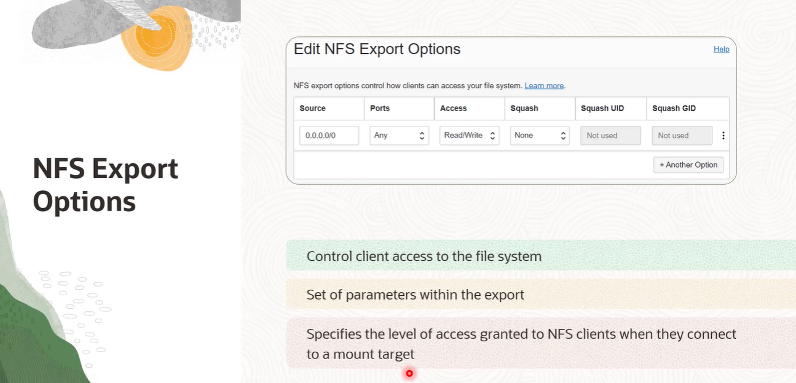

# File Storage

- [File Storage](#file-storage)
  - [Overview](#overview)
    - [File Storage Concepts](#file-storage-concepts)
      - [what is Mount Target](#what-is-mount-target)
      - [what is Export](#what-is-export)
      - [Infra Chart](#infra-chart)
  - [Steps to Mount  File System](#steps-to-mount--file-system)
    - [NFS Export Options](#nfs-export-options)
      - [Example](#example)
      - [:warning:](#warning)
      - [Access Control Settings](#access-control-settings)
      - [File System Path](#file-system-path)
        - [what is Export path](#what-is-export-path)
        - [What is Mount point path](#what-is-mount-point-path)
        - [What is File System path](#what-is-file-system-path)

## Overview 

### File Storage Concepts

#### what is Mount Target

#### what is Export

#### Infra Chart

## Steps to Mount  File System

> :one: Check Security List and Network Security Group for access rules

> :two: Launch OCI Instance

> :three: Install nfs-units or nfs-common

> :four: create a directory

> :five: check mount targets in the OCI console

> :six: copy the mount commands and run on the client

  

### NFS Export Options

NFS Export Options enable you to create more granular access control. You can specify access levels for IP addresses or CIDR blocks, connecting to the file system through exports in a mount target. And access can be restricted so that each client's file system is inaccessible and invisible to the other so you can control access to the file system. NFS Export Options are a set of parameters within the Export that specifies the level of access granted to NFS clients when they connect to a mount target.

  

#### Example
  

:a: 

 

:b:

 

#### :warning:

#### Access Control Settings

#### File System Path

##### what is Export path

##### What is Mount point path

##### What is File System path

