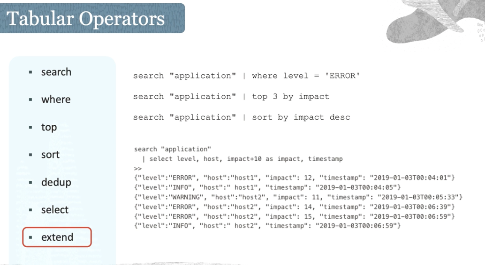

# :cloud: Observability and Management - loggings


## overview 
> Overview of Object Storage
>  


> 
> types of Logs
> 


> 
> Work flow of Oracle Logging Services
> 


## Fundamental Concepts
### Log Groups 
> 


> what is a log group
- [x] it is a collection of logs stored in A single compartment
- [x] it is a logical container for logs to streamline log management
- [x] Logs and log groups are searchable and transportable
- [x] can be used to limit access to sensitive logs by using an IAM policy 
  
### Service Log Category

Each service can habe different log categories for difference resources. e.g the load balance logs give your categories like access and error log, object storage services will give your logs in category read and write in bucket.  

### service Connector Hub

It helps you moving logging data to other services like archiving log data in object storage.
e.g For example, if you want to set up an alarm for a specific log pattern, you can create a search condition for that pattern and then use ```Service Connector``` to move that data into the monitoring service. 

### Unified Monitoring Agent

Fluentd-based agent that runs on OCI instance to help customers ingest custom logs.
And it is a fully managed agent on OCI instances. This agent is used to ingest custom events from your applications running on OCI instances. Or if you are running external instances, which is outside of OCI environment, you could install this agent manually and collect custom logs.

### Unified Monitoring Agent Configuration

Unified Monitoring Agent configuration that specifies how custom logs are ingested.

### Audit 

Records API calls to OCI public API endpoints as Log EVENTS
> 


## Service Logs Type Examples
>
> Object Storage Service Logs
>


> Load Balancer Logs
>


>
> Virtual Cloud Network Flow Logs
>


## Working With Custom Logs

> what is Custom Logs?
> It is logs from Custom Applications, On-Premises, External to OCI environment

> Customs Logs are ingested via / using: 
> 
> :white_check_mark: API `PutLogs`
>
> :white_check_mark: Unified Monitoring Agent
>

### Using Unified Monitoring Agent ( CNCF standards)
:white_check_mark: Based on Fluentd(CNCF V1.0)

:white_check_mark: Enabled through Oracle Cloud Agent Plugin

:white_check_mark: Installed manually on external systems


### Monitoring Agent Communication Workflow


Let's look into the workflow of this agent. Enabling custom logs is a 2-step process. 

- The first step is where you can see the source environment, and you would need to install the agent binary on each of those instances or those workloads where you wanted to collect the logs. The agent is responsible to fetch the data as instructed by the agent configuration.

- The second step is the agent configuration, which you create within the OCI Logging Service. You would specify which of those host or instances you wanted to collect the logs, what specific logs you wanted to collect, whether it could be syslogs or application level logs, and then you could add parsers into this configuration.

### Agent Services on Instances

After installation of the plugins on compute instance, you can find the following services.


There are four services running on Linux-based instances, and these would apply to the agent enabled through the plugin UI. 
- The main service here is the Unified Monitoring Agent service. And this is the service that you need to check when you have any problems with collecting the logs.
- The Unified Monitoring Agent config downloader service is a service that is used to update the service configuration automatically. 
- The downloader timer service is the service that triggers the above downloader service on given intervals. 
- The restarter path service triggers when you have to reload the service configuration if a change is detected for the Unified Monitoring Agent.

### Agent Configurations


:white_check_mark: Host Groups with Dynamic Groups ( a group of Instances ) within OCI environemnt

    Looking at the Agent configuration, one of the configuration step is to specify which host you want to collect the logs from. This can be done through a section called host groups. If the source environment is a set of compute instances, you would choose a dynamic group that defines the list of these instances where you want to collect the logs.

:white_check_mark: User Group 

    There is also a second type of host group which is called a User Group. The User Group is used when you have instances running outside of the OCI environment.
    You would need to create a user security group, create a dedicated user, add this user in the group with IAM policies to access the log content, and then configuring the API signing keys to authenticate between source systems and OCI. Once you have configured these steps, you would select this user group as the host group, and then following with the remaining configurations.

:white_check_mark: log inputs

    The next component in an agent configuration is it allows you to easily select the type of logs you want to ingest. There are few supported log inputs. You can choose a Windows event log which will have event channels for application, system, or security. Or you can choose the log directory path where you can specify the path of the log file.

    Usually a path is specified for Linux systems and the varlog message is an example. We spoke about parsers, and these are advanced parsers to the previous step.

:white_check_mark: Parsers

    You have options to select parsers like Auditd or JSON, CSV or syslog, and also a few more to help with parsing the data in the chosen format.

:white_check_mark:  Log destination

    Log destination defines the compartment where you wanted to store the logs, the name of the log group, and the log object for those custom logs.

## Access, Search and Explore Logs

### IAM Policies

:white_check_mark:  inspect :white_check_mark: read :white_check_mark:  use :white_check_mark:  manage

--------------------------------------->


## Searching Logs with Queries




