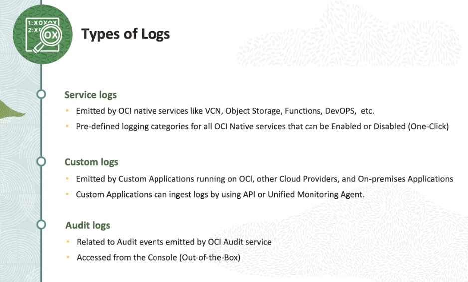
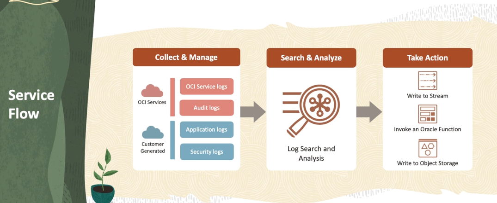
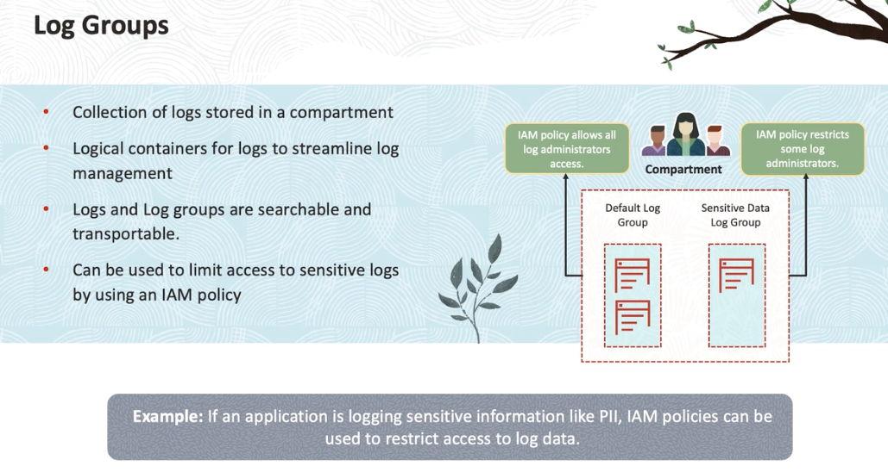

# :cloud: Observability and Management - loggings


## overview 
> Overview of Object Storage
>  


> 
> types of Logs
> 


> 
> Work flow of Oracle Logging Services
> 



## Fundamental Concepts
### Log Groups 
> 


> what is a log group
- [x] it is a collection of logs stored in A single compartment
- [x] it is a logical container for logs to streamline log management
- [x] Logs and log groups are searchable and transportable
- [x] can be used to limit access to sensitive logs by using an IAM policy 
  
### Service Log Category

Each service can habe different log categories for difference resources. e.g the load balance logs give your categories like access and error log, object storage services will give your logs in category read and write in bucket.  

### service Connector Hub

It helps you moving logging data to other services like archiving log data in object storage.
e.g For example, if you want to set up an alarm for a specific log pattern, you can create a search condition for that pattern and then use ```Service Connector``` to move that data into the monitoring service. 

### Unified Monitoring Agent

Fluentd-based agent that runs on OCI instance to help customers ingest custom logs.
And it is a fully managed agent on OCI instances. This agent is used to ingest custom events from your applications running on OCI instances. Or if you are running external instances, which is outside of OCI environment, you could install this agent manually and collect custom logs.

### Unified Monitoring Agent Configuration

Unified Monitoring Agent configuration that specifies how custom logs are ingested.

### Audit 

Records API calls to OCI public API endpoints as Log EVENTS
> 
