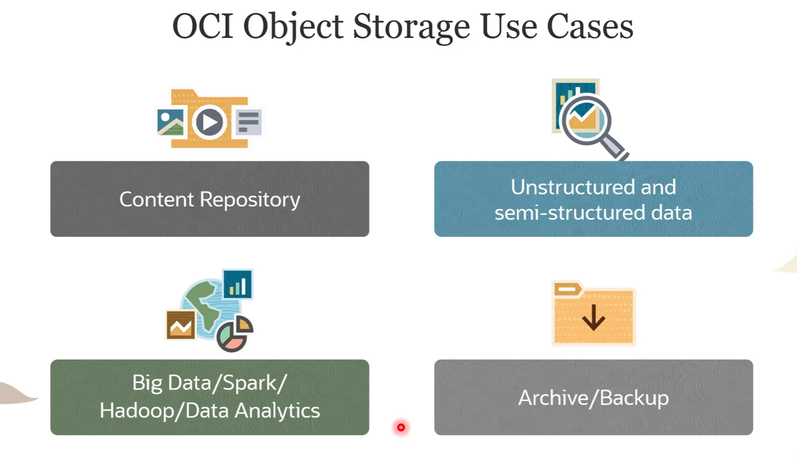
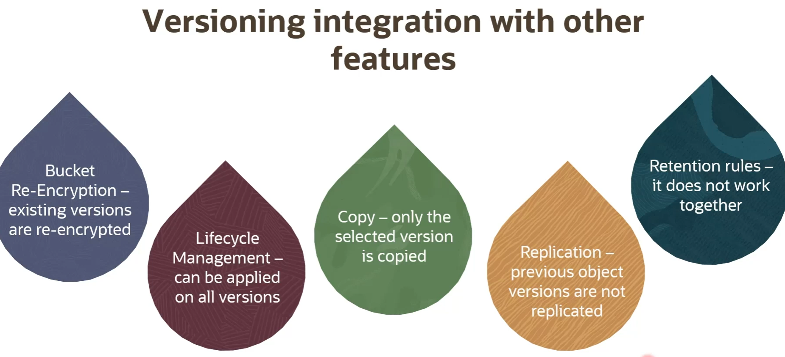

# :cloud: Object Storage Basics & Advanced

- [:cloud: Object Storage Basics \& Advanced](#cloud-object-storage-basics--advanced)
  - [Overview](#overview)
  - [Object Storage Resources](#object-storage-resources)
  - [Object Storage Tiers](#object-storage-tiers)
    - [Difference Between these 3 tiers](#difference-between-these-3-tiers)
    - [Auto Tiering](#auto-tiering)
  - [Object Lifecycle Management](#object-lifecycle-management)
  - [:blossom: Object Storage Replication](#blossom-object-storage-replication)
  - [:page\_with\_curl: Object Versioning](#page_with_curl-object-versioning)
    - [Object Versioning Status](#object-versioning-status)
  - [Retention Rules](#retention-rules)
    - [To understand time-bound retention rules, examples](#to-understand-time-bound-retention-rules-examples)
  - [:train: Object Copy](#train-object-copy)
  - [Skill Checks](#skill-checks)

## Overview
> Overview of Object Storage
> 

> Object Storage Use Cases
>

## Object Storage Resources

> Endpoint Example 
>

## Object Storage Tiers

Storage Tiers can help with 
- maximize access performance
- Minimize storage costs

During Creation of a Bucket, you can chose 
- [x] Standard Storage Tier Bucket 
- [x] Archive Stroage Tier Bucket

`Within standard tier bucket`, you can explicitly assign storage tier to an object, the options are 
- [ ] Standard
- [ ] Infrequent Access
- [ ] Archive

### Difference Between these 3 tiers

### Auto Tiering
> :sunny: Only between Standard tier and Infrequent Access Tier
>

## Object Lifecycle Management

Object lifecycle management lets you manage the `lifecycle of your object storage data` through `automated archiving` and `deletion`, reducing storage costs and saving time. Object lifecycle management works by taking automated action based on the `rules` you define. 
The supported lifecycle action includes 
- [ ] :cloud: moving to infrequent access, 
- [ ] :cloud: moving to archive, 
- [ ] :fire: and delete.

> Thing to watchout
>

> Example of a typical Object Lifecycle Management Rules
>

`we can move standard tier objects to the archive tier 30 days after creation or last update. And then after 180 days, we can automatically delete those archived objects. And just to add, you can create another lifecycle policy rule that deletes uncommitted or failed multi-part upload after five days`

_______________

## :blossom: Object Storage Replication 
> Replicates objects from one bucket to another in the same or different Region
> , 
>- :warning: Once a bucket becomes destination bucket, it can only be updated via the source bucket.
>- :warning: objects uploaded before replication policy  are ignored, thus not replicated 

## :page_with_curl: Object Versioning

Versioning directs object storage to automatically create an object version, each time a new object is uploaded, an existing object is overwritten, or when an object is deleted. It is enabled at the bucket level. You can enable object versioning at bucket creation time or later. You cannot disable object versioning. You can, however, suspend versioning.

It provides data protection against accidental or malicious object update, overwrite, or deletion. There is always one latest version of the object and zero or more previous versions. And you are going to be charged for all the latest object versions and previous object version. The previous object versions are retained until you explicitly delete them.

### Object Versioning Status
- Disabled
- Enabled
- Suspended
  

## Retention Rules

:warning: `You cannot add retention rules to versioning enabled buckets. It only works with disabled/suspended versioning status.`

Retention rules protect your data from accidental or malicious update, overwrite, or deletion. It also provides immutable WORM-compliant storage options for data return to objects storage and archive storage, and the retention rules can be locked to prevent rule modification and data deletion or modification, even by administrators. Please, note that the retention rules are configured at the bucket level.

There are two types of retention rules.

- time-bound :watch:
  - The first is time-bound, where you specify a duration during the creation of a retention rule. Object modification and deletion are prevented for the duration that you specify. 
- indefinite  :imp:
  - The second retention rule type is indefinite, where object modification and deletion are prevented, until you delete the rule.

### To understand time-bound retention rules, examples

`we have a time-bound retention rule of the duration of 1 year, we have two objects here 1 which was last modified 14 months ago and another 3 month ago. The retention rule will allow update/delete on Ocitest oject since the last update was 14 months ago (> 12 months) , and prevent ocidemo from updating/deletion (< 12 months)`

## :train: Object Copy 

## Skill Checks

1. Which two types of object name filters are supported while configuring a lifecycle policy rule in Object Storage service?
- [x] Prefix matching
- [ ] Regex matching
- [x] Pattern matching
- [ ] Filter matching

2. You would like to store some data that is *_seldom accessed_* but requires long retention periods. Which storage tier should you use to make the solution more cost effective?
- [X] Archive
- [ ] Standard
- [ ] Reduced Redundancy
- [ ] Infrequent Access

3. You would like Object Storage service to monitor the data access pattern and help you reduce costs by automatically moving objects larger than 1 MiB out of the Standard tier into the more cost-effective Infrequent Access tier. Which feature should you enable?
- [ ] Auto-Transition
- [ ] Auto-Move
- [ ] Auto-Change
- [x] Auto-Tiering

4. Which of the following is not a valid storage tier in Object Storage service?
- [ ] Standard
- [ ] Archive
- [ ] Infrequent Access
- [x] Glacier

5. You want to upload a 2 TiB object to Object Storage. You would like to have the flexibility of pausing between the uploads of individual parts and resuming the upload when your schedule allows. Which feature should you use?
- [ ] Splitpart uploads
- [x] Multipart uploads
- [ ] Split upload
- [ ] Simultaneous upload